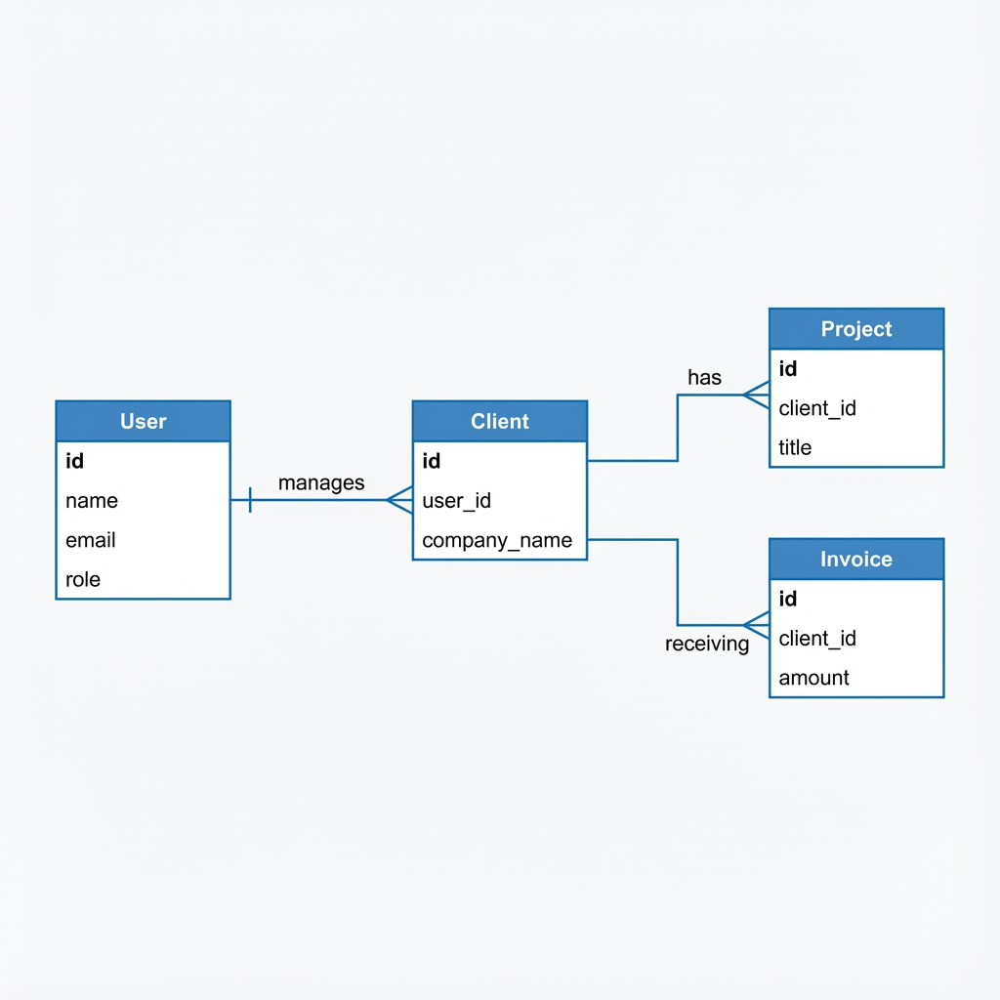
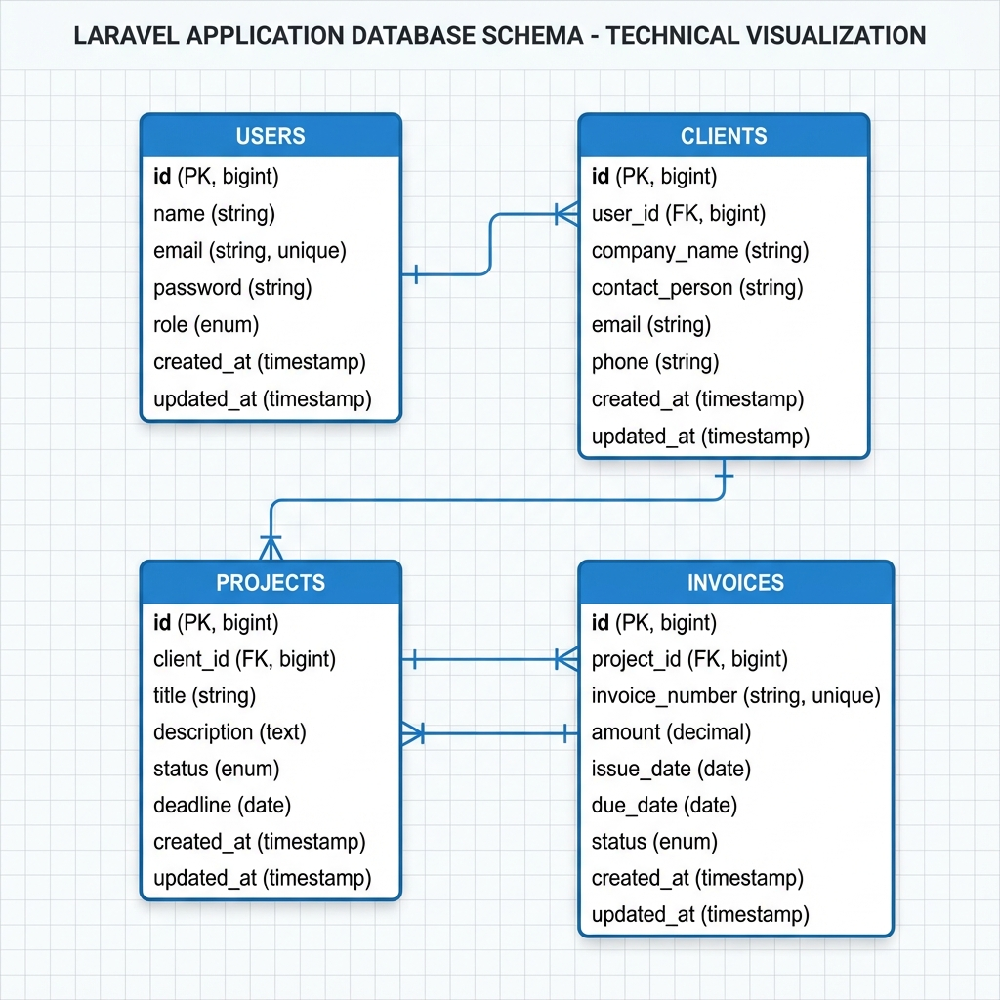
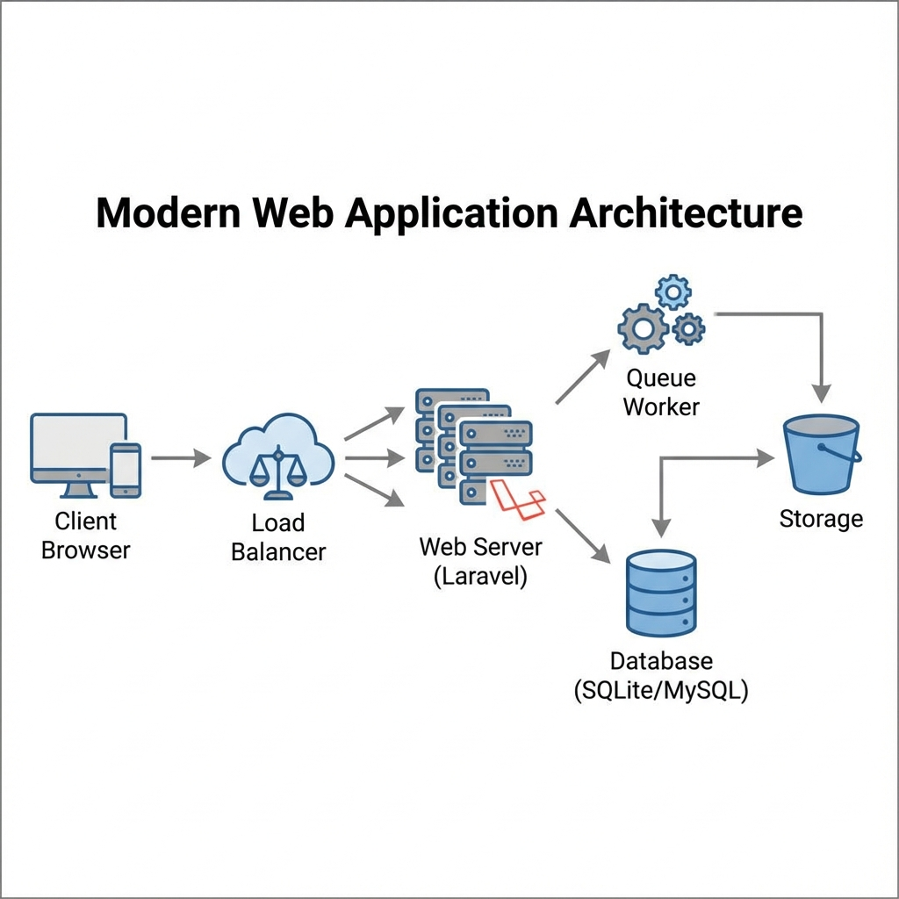
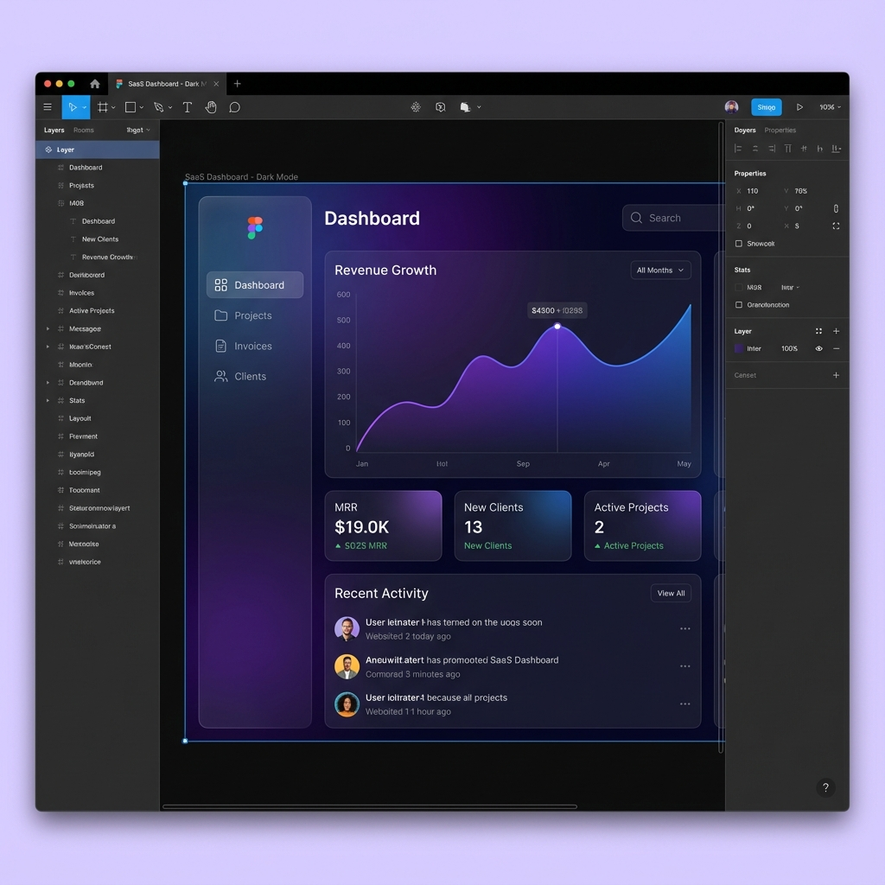

# Project Documentation

Welcome to the documentation for the Portfolio ERP System.

## Contents

### 1. General
-   [Project Explanation](project_explanation.md): A comprehensive overview of the project features, tech stack, and logic.

### 2. Diagrams & Visuals
-   **ERD (Entity Relationship Diagram)**:
    -   
    -   [Mermaid Source](erd_diagram.md)
-   **Database Schema**:
    -   
-   **System Design**:
    -   
    -   [Mermaid Source](system_design.md)

### 3. Design
-   **Figma Design Mockup**:
    -   

### 4. Technical
-   [UML Diagrams](uml_diagrams.md): Class diagrams for core models.

## How to use this documentation
This `docs` folder contains all the necessary architectural and design documents to understand the system. Open the markdown files in any markdown viewer or GitHub.
