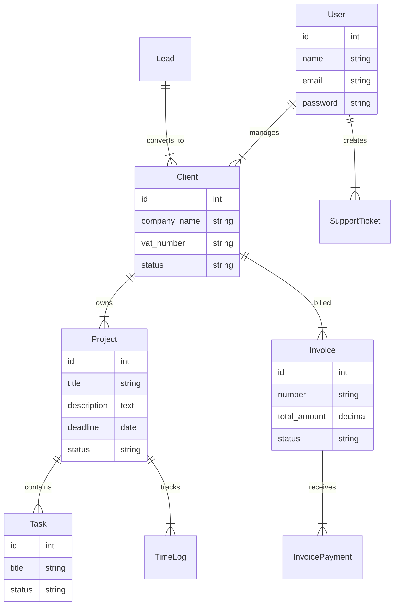

# Entity Relationship Diagram (ERD)

```mermaid
erDiagram
    User ||--|{ Client : manages
    User ||--|{ SupportTicket : creates
    Client ||--|{ Project : owns
    Client ||--|{ Invoice : billed
    Project ||--|{ Task : contains
    Project ||--|{ TimeLog : tracks
    Invoice ||--|{ InvoicePayment : receives
    Lead ||--|{ Client : converts_to

    User {
        id int
        name string
        email string
        password string
    }

    Client {
        id int
        company_name string
        vat_number string
        status string
    }

    Project {
        id int
        title string
        description text
        deadline date
        status string
    }

    Invoice {
        id int
        number string
        total_amount decimal
        status string
    }

    Task {
        id int
        title string
        status string
    }
```
