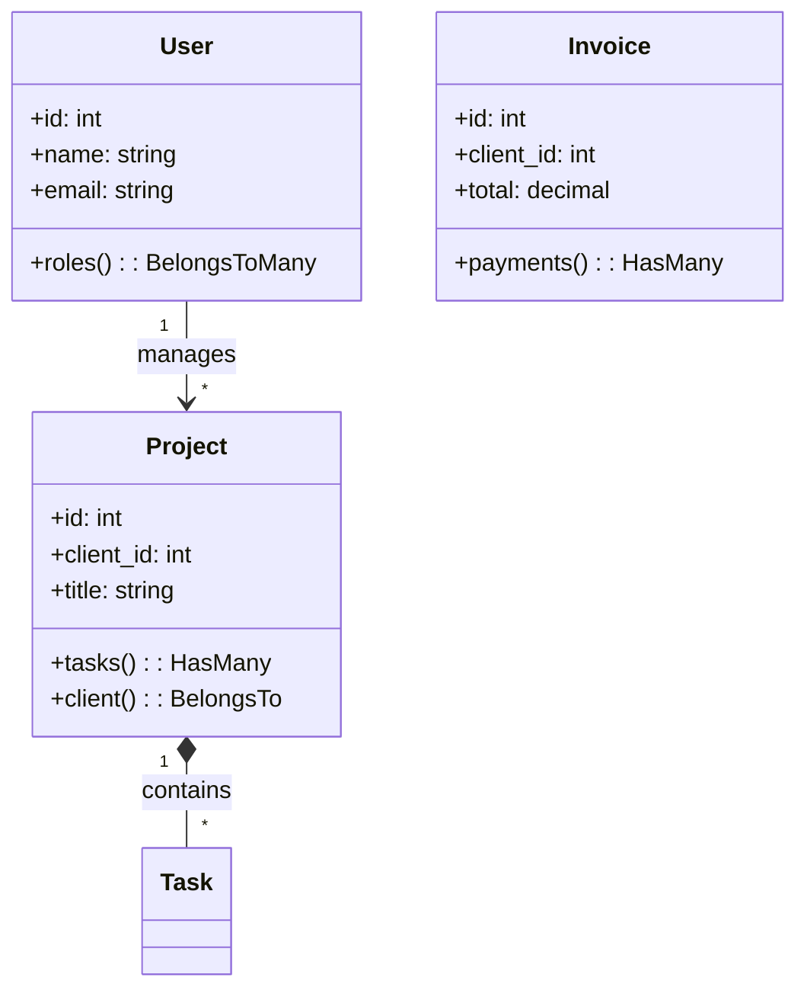

# UML Class Diagrams

## Core Models

```mermaid
classDiagram
    class User {
        +id: int
        +name: string
        +email: string
        +roles(): BelongsToMany
    }

    class Project {
        +id: int
        +client_id: int
        +title: string
        +tasks(): HasMany
        +client(): BelongsTo
    }

    class Invoice {
        +id: int
        +client_id: int
        +total: decimal
        +payments(): HasMany
    }

    User "1" --> "*" Project : manages
    Project "1" *-- "*" Task : contains
```
